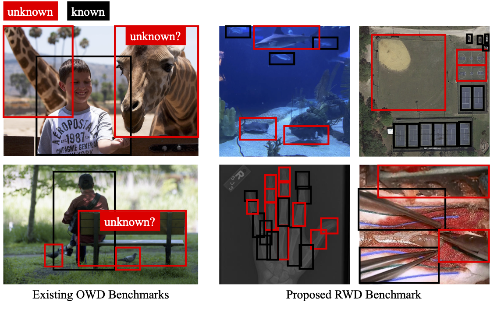
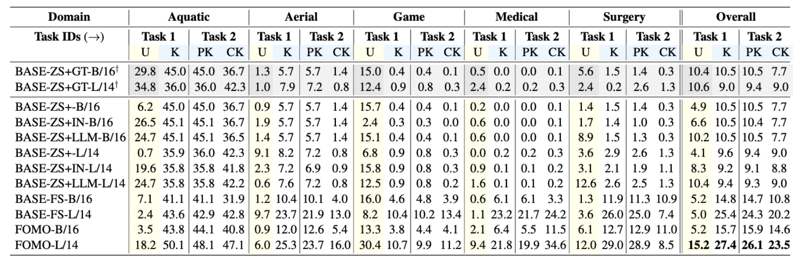

# Open World Object Detection in the Era of Foundation Models

[`arXiv`](https://arxiv.org/abs/2312.05745) 
[`website`](https://orrzohar.github.io/projects/fomo/)

#### [Orr Zohar](https://orrzohar.github.io/), [Alejandro Lozano](https://www.linkedin.com/in/ale9806/), [Shelly Goel](https://www.linkedin.com/in/shelly-goel-2023/), [Serena Yeung](https://marvl.stanford.edu/people.html), [Jackson Wang](https://wangkua1.github.io/)

<h5 align="center"> If you like our project, please give us a star ⭐ on GitHub for latest updates!  </h2>


## 📰 News
* **[2024.1.5]**  Initial release of the RWD dataset. I will be updating the arXiv after a bug was found, causing some variations to the original numbers. 


## 🔥 Highlights
The proposed Real-World Object Detection (RWD) benchmark consists of five real-world, application-driven
datasets: 

<div align="center">
    
</div>

FOMO is a novel approach in Open World Object Detection (OWOD), harnessing foundation models to detect unknown objects 
by their shared attributes with known classes. It generates and refines attributes using language models and known class
exemplars, enabling effective identification of novel objects. Benchmarked on diverse real-world datasets, FOMO 
significantly outperforms existing baselines, showcasing the potential of foundation models in complex detection tasks.




## 🛠️ Requirements and Installation

We have trained and tested our models on `Ubuntu 20.04`, `CUDA 12.2`, `Python 3.7.16`

```bash
conda create --name fomo python==3.7.16
conda activate fomo
pip install -r requirements.txt
conda install pytorch==1.13.1 torchvision==0.14.1 torchaudio==0.13.1 pytorch-cuda=11.6 -c pytorch -c nvidia
```

## 📸 Dataset Setup
Dataset setup instruction is in [DATASET_SETUP.md](DATASET_SETUP.md).

## 🗝️ Training and Evaluation
*Note: you may need to give permissions to the .sh files under the 'configs' and 'tools' directories by running 
`chmod +x *.sh` in each directory. To run the OWOD baselines, use the configurations defined in ``\configs``:

### OWOD
1. run_owd.sh - evaluation of tasks 1-4 on the SOWOD/MOWOD Benchmark.
2. run_owd_baseline.sh - evaluation of tasks 1-4 on the SOWOD Benchmark.

### RWD
To run FOMO:
1. run_rwd.sh - evaluation of all datasets on task 1 RWD Benchmark. 
2. run_rwd_t2.sh - evaluation of all datasets on task 2 RWD Benchmark.

To run baselines:
3. run_rwd_baselines.sh - evaluation of all datasets on task 1 RWD Benchmark. 
4. run_rwd_t2_baselines.sh - evaluation of all datasets on task 2 RWD Benchmark. 
5. run_rwd_fs_baseline.sh - evaluation of the few-shot baseline on all datasets on task 1 RWD Benchmark. 
6. run_rwd_t2_fs_baseline.sh - evaluation of the few-shot baseline on all datasets on task 2 RWD Benchmark. 


**Note:**
Please check the [Deformable DETR](https://github.com/fundamentalvision/Deformable-DETR) repository for more evaluation 
details.


## ✏️ Citation
If you find our paper and code useful in your research, please consider giving a star :star: and citation :pencil:.
```bibtex
@InProceedings{zohar2023open,
    author    = {Zohar, Orr and Lozano, Alejandro and Goel, Shelly and Yeung, Serena and Wang, Kuan-Chieh},
    title     = {Open World Object Detection in the Era of Foundation Models},
    booktitle = {arXiv preprint arXiv:2312.05745},
    year      = {2023},
}
```

## 📧 Contact

Should you have any questions, please contact :e-mail: orrzohar@stanford.edu

## 👍 Acknowledgements
FOMO builds on other code bases such as:
* [PROB](https://github.com/orrzohar/PROB) - PROB: Probabilistic Objectness for Open World Obejct Detection codebase.
* [OWL-ViT](https://github.com/huggingface/transformers/tree/main/src/transformers/models/owlvit) - The Transformer's library implementation of OWL-ViT.

If you found FOMO useful please consider citing these works:
```bibtex
@InProceedings{Zohar_2023_CVPR,
    author    = {Zohar, Orr and Wang, Kuan-Chieh and Yeung, Serena},
    title     = {PROB: Probabilistic Objectness for Open World Object Detection},
    booktitle = {Proceedings of the IEEE/CVF Conference on Computer Vision and Pattern Recognition (CVPR)},
    month     = {June},
    year      = {2023},
    pages     = {11444-11453}
}
```

```bibtex
@article{minderer2022simple,
    title   = {Simple Open-Vocabulary Object Detection with Vision Transformers},
    author  = {Matthias Minderer, Alexey Gritsenko, Austin Stone, Maxim Neumann, Dirk Weissenborn, Alexey Dosovitskiy, Aravindh Mahendran, Anurag Arnab, Mostafa Dehghani, Zhuoran Shen, Xiao Wang, Xiaohua Zhai, Thomas Kipf, Neil Houlsby},
    journal = {ECCV},
    year    = {2022},
}
```

## ✨ Star History
[](https://star-history.com/#orrzohar/FOMO&Date)

